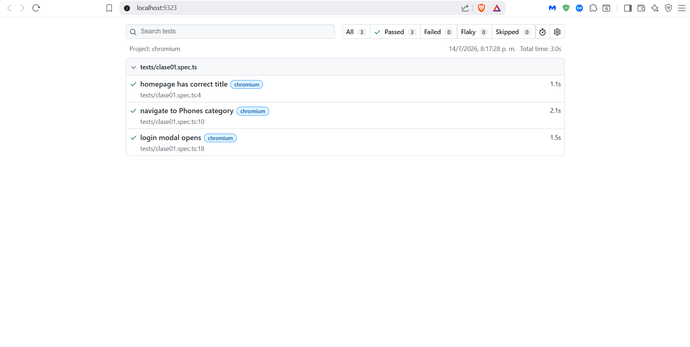

# Proyecto QA - Demoblaze ejercicio

**Nombre:** Bagner Francisco Ojeda Esquite  
**Carné:** 1790-18-25212
**Node.js Version:** v24.18.0  
**Playwright Version:** 1.61.1  

## Tests
Este proyecto contiene 3 pruebas automatizadas con Playwright:
1. Verificar título de la página principal.
2. Navegar a la categoría "Phones".
3. Abrir el modal de login.

## Evidencia

