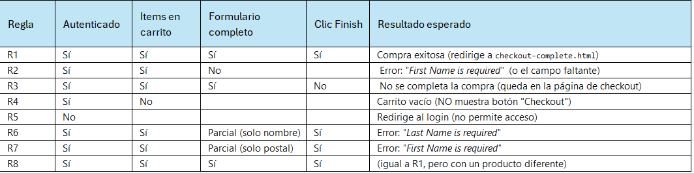

# Tabla de Decisión 

## Condiciones evaluadas
1. **Usuario autenticado** (Sí / No)
2. **Carrito con items** (Sí / No)
3. **Formulario de checkout completo** (Sí / No)
4. **Clic en "Finish"** (Sí / No)

---

## Verificación del comportamiento REAL (previo a la tabla)
Antes de crear la tabla, debes probar manualmente en la app para confirmar cómo se comporta:

**Pregunta 1**: ¿Qué pasa si accedes a checkout-step-one.html sin sesión?
Respuesta: la aplicación redirige al login (/).
Esto asegura que no se puede entrar al checkout sin estar autenticado.

**Pregunta 2**: ¿Qué pasa si el carrito está vacío al hacer checkout?
Respuesta: el botón “Checkout” NO aparece.
El sistema no permite avanzar si no hay productos en el carrito.

**Pregunta 3**: ¿El mensaje de error es igual sin importar qué campo falta?
Respuesta: aparecen mensajes de error específicos según el campo faltante:

-Si falta First Name: "First Name is required"
-Si falta Last Name: "Last Name is required"
-Si falta Postal Code: "Postal Code is required"

---

## Tabla de Decisión (8 reglas)

---

## Resumen de acciones
- ✅ **Compra exitosa:** Redirige a `checkout-complete.html`.
- ❌ **Error en formulario:** Muestra mensaje específico.
- ⏸️ **Compra no completada:** Usuario no hace clic en "Finish".
- 🛒 **Carrito vacío:** No muestra botón "Checkout".
- 🔒 **Sin sesión:** Redirige al login.
