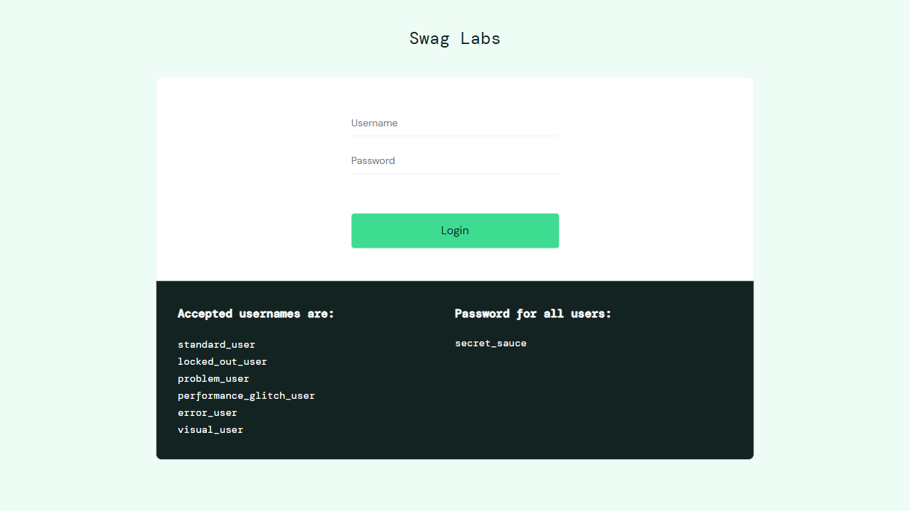
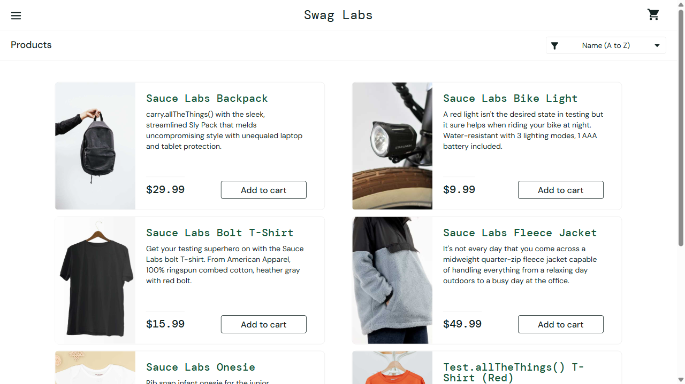
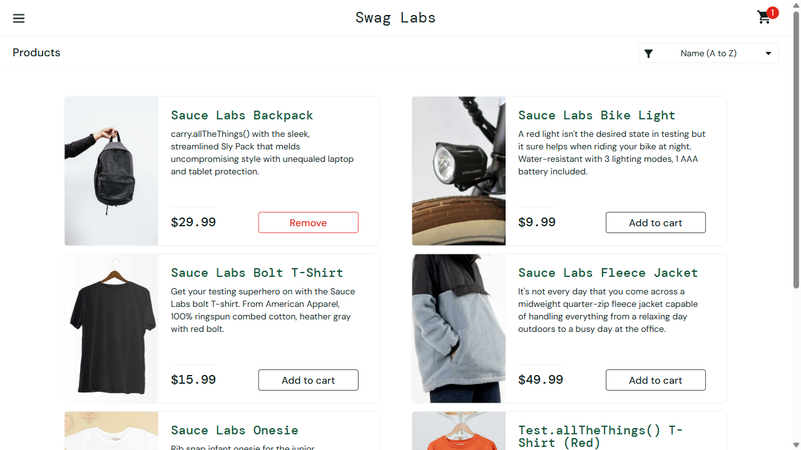

# DR-001: Reporte de defecto simulado

## Información general

| Campo | Valor |
|-------|-------|
| **ID del defecto** | DR-001 |
| **Título** | Fallo forzado en la validación del contador del carrito |
| **Fecha de reporte** | 2026-09-11 |
| **Reportado por** | Bagner Francisco Ojeda Esquite |
| **Carné** | 1790-18-25212 |
| **Estado** | Simulación finalizada; valor esperado restaurado |
| **Severidad** | Media |
| **Prioridad** | Media |
| **Entorno** | Sauce Demo, Playwright y Chromium en Windows |

## Descripción

Se simuló un defecto en la prueba `Comparar estados antes y después de una acción`, del archivo `tests/clase07.spec.ts`. Para provocar el fallo, se cambió temporalmente la aserción del contador del carrito de `toHaveText('1')` a `toHaveText('2')`.

La aplicación mostró correctamente `1` después de agregar un producto. La prueba falló porque se configuró intencionalmente un valor esperado incorrecto. No se identificó un defecto real en el contador del carrito.

## Pasos para reproducir la simulación

1. En `tests/clase07.spec.ts`, localizar la prueba `Comparar estados antes y después de una acción`.
2. Cambiar `await expect(badgeDespues).toHaveText('1');` por `await expect(badgeDespues).toHaveText('2');`.
3. Ejecutar desde la raíz del proyecto: `npx playwright test tests/clase07.spec.ts`.
4. La prueba navega a `https://www.saucedemo.com`, inicia sesión con el usuario `standard_user` y la contraseña `secret_sauce`, y agrega el primer producto al carrito.
5. Verificar que la aserción falle al comparar el valor esperado `2` con el valor real `1`.
6. Revisar las evidencias de esa ejecución con `npx playwright show-report` antes de ejecutar nuevamente la suite.

## Resultado esperado

En el funcionamiento normal, el contador debe mostrar `1` al agregar un producto. En la simulación, la prueba debe fallar porque se modificó el valor esperado a `2`.

## Resultado obtenido

El contador mostró `1` y Playwright reportó `Expected: "2"` y `Received: "1"`. El fallo se repitió en el primer reintento, lo que confirmó la simulación.

La ejecución registrada terminó con **5 pruebas aprobadas y 2 fallidas**. Una correspondía a esta simulación; la otra, a `RETO 3: Comparación visual con toHaveScreenshot()`, falló porque aún no existían las imágenes de referencia. Ese segundo fallo es independiente de DR-001.

## Evidencia

### Capturas de pantalla

Las siguientes imágenes documentan el flujo. Las rutas son relativas a este archivo, ubicado en `reportes/`.

**Paso 1. Pantalla de inicio de sesión.**



**Paso 2. Inventario antes de agregar un producto.**



**Paso 3. Estado después de agregar un producto, con la aserción correcta.**



La tercera captura se genera después de `toHaveText('1')` en el código restaurado. No es una captura del fallo simulado: con el valor esperado `2`, la ejecución se detiene en la aserción antes de alcanzar esa captura manual.

### Log de la simulación

Extracto del resultado de ejecución registrado durante la simulación:

```text
Error: expect(locator).toHaveText(expected) failed

Locator:  locator('.shopping_cart_badge')
Expected: "2"
Received: "1"
Timeout:  5000ms

await expect(badgeDespues).toHaveText('2');

2 failed
5 passed (1.2m)
```

### Captura automática, video y traza

El log de la simulación registra los archivos `test-failed-1.png`, `video.webm` y `trace.zip` generados por Playwright. Sin embargo, los archivos actuales de `test-results/` corresponden a una ejecución posterior aprobada; la captura automática del fallo ya no está en esa carpeta.

Para abrir el reporte HTML disponible, ejecutar desde la raíz del proyecto:

```bash
npx playwright show-report
```

El reporte actual permite revisar las capturas, los videos y las trazas de la ejecución más reciente, no necesariamente los de la simulación. Las carpetas `test-results/` y `playwright-report/` están excluidas de Git mediante `.gitignore`. Para conservar evidencias de una simulación futura, copiar sus archivos a una carpeta de evidencias antes de volver a ejecutar las pruebas.

## Causa del fallo

El fallo fue causado por la modificación intencional del valor esperado en la aserción. No hay evidencia de productos duplicados ni de un error en la lógica del carrito.

## Restauración y verificación

La aserción está restaurada en `tests/clase07.spec.ts`:

```ts
await expect(badgeDespues).toHaveText('1');
```

El archivo local `test-results/.last-run.json` registra la última ejecución con `status: "passed"` y `failedTests: []`. Esto respalda el estado aprobado de la última ejecución guardada. Para repetir la verificación, ejecutar:

```bash
npx playwright test tests/clase07.spec.ts
```
